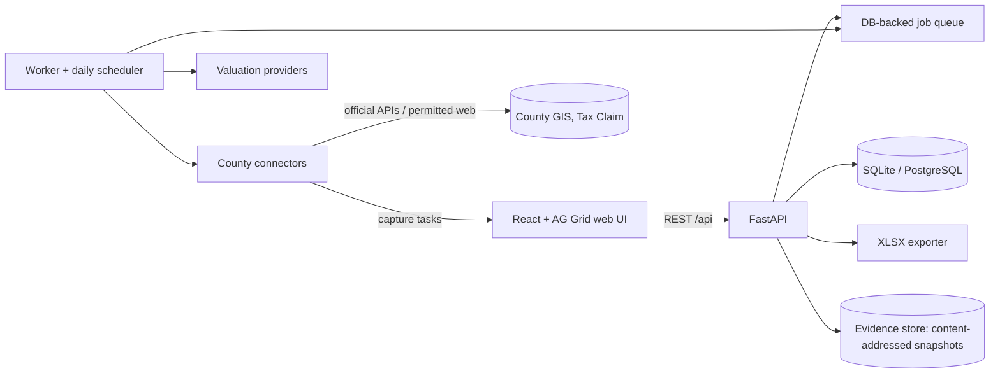

# Upset Sale Intel

Property intelligence and upset-sale research for **Montgomery County, Pennsylvania** and **Delaware County, Pennsylvania** (not the State of Delaware).

The app takes a county upset-sale PDF and runs the full research workflow on it:

1. Extract every property row, with PDF page provenance and confidence scores.
2. Let you review and correct the extracted rows.
3. Run a 7–8 property pilot, then the full list.
4. Enrich each property from official county data and licensed valuation APIs.
5. Apply the investment criteria, with a written pass / fail / unknown explanation for every rule.
6. Show the results in a spreadsheet-style grid that mirrors the reference workbook.
7. Export the research workbook (`.xlsx`) with conditional formatting, evidence and audit sheets.

> **Informational research only.** This is not legal, title, appraisal, tax, investment or lien-clearance advice. County web data is not a certified search, and automated valuations are estimates. Verify everything with official records and qualified professionals before bidding.

---

## Contents

- [Quick start](#quick-start)
- [Exact commands](#exact-commands)
- [How county data is accessed](#how-county-data-is-accessed)
- [Architecture](#architecture)
- [Configuration (environment variables)](#configuration-environment-variables)
- [Valuation providers and API keys](#valuation-providers-and-api-keys)
- [Daily refresh scheduling](#daily-refresh-scheduling)
- [Security and compliance](#security-and-compliance)
- [Testing](#testing)
- [Deployment](#deployment)
- [Repository layout](#repository-layout)
- [Known limitations and items to verify](#known-limitations-and-items-to-verify)

Further reading: [docs/ARCHITECTURE.md](docs/ARCHITECTURE.md), [docs/SOURCE_ACCESS.md](docs/SOURCE_ACCESS.md), [docs/WALKTHROUGH.md](docs/WALKTHROUGH.md), [docs/DEPLOYMENT_BROWSER.md](docs/DEPLOYMENT_BROWSER.md).

---

## Quick start

Prerequisites:

- Python 3.11+ (developed on 3.14)
- Node.js 20+ (developed on 24)
- Optional: [Tesseract OCR](https://github.com/tesseract-ocr/tesseract), only for image-only PDF pages

From the repository root:

```bash
python dev.py --seed
```

`dev.py` performs these steps:

1. Creates `backend/.venv` and installs Python dependencies (first run only).
2. Runs `npm install` (first run only).
3. Migrates the database. The default is SQLite at `backend/data/app.db`.
4. Loads two anonymized demo projects (`--seed`).
5. Starts the API (http://127.0.0.1:8000/docs), the background worker with its daily scheduler, and the web UI (http://127.0.0.1:5173).

Stop everything with Ctrl+C.

The demo projects are built from anonymized pages of the supplied PDFs:

- Source records are labelled **DEMO FIXTURE**.
- Market values come from the **SANDBOX** provider.
- Nothing in them is real valuation data, and the demo never contacts external services.

---

## Exact commands

All CLI commands run from `backend/` with the virtual environment's Python. On Windows use `.venv\Scripts\python`; on macOS/Linux use `.venv/bin/python`. The UI performs every step below too; see [docs/WALKTHROUGH.md](docs/WALKTHROUGH.md).

**Run the app** (from the repo root):

```bash
python dev.py
```

**Run the API and worker separately** (from `backend/`):

```bash
.venv\Scripts\python -m uvicorn app.main:app --port 8000
```

```bash
.venv\Scripts\python -m app.jobs.worker
```

**Run the tests.** Backend (from `backend/`):

```bash
.venv\Scripts\python -m pytest
```

Frontend unit tests and build (from `frontend/`):

```bash
npm test
```

```bash
npm run build
```

End-to-end, starting both servers automatically (from `frontend/`):

```bash
npm run test:e2e
```

**Configure providers.** Keys are stored encrypted and never displayed again. The Settings → Valuation & image providers page does the same.

```bash
.venv\Scripts\python -m app.cli set-secret --name provider.attom.api_key
```

```bash
.venv\Scripts\python -m app.cli set-secret --name provider.rentcast.api_key
```

Then enable the provider in the UI, or with `PUT /api/providers/attom {"enabled": true}`.

**Acknowledge the Montgomery Tax Claim Bureau terms.** This is required before its automated lookups run; see [compliance](#security-and-compliance).

```bash
.venv\Scripts\python -m app.cli acknowledge-terms --source montco.tax_claim --note "Describe your permitted use"
```

**Create a project and upload a PDF.** The first command prints the project ID; the second extracts and commits the rows.

```bash
.venv\Scripts\python -m app.cli create-project --name "Delco upset sale 2026-09-24" --county delco
```

```bash
.venv\Scripts\python -m app.cli import --project-id 1 --file "E:\PROJECTS\Delaware County PA\UpsetSaleList_8-28-2026.PDF" --commit
```

In the UI, use **Import & review** to see flagged rows and page images before committing.

**Run the 7–8 row pilot:**

```bash
.venv\Scripts\python -m app.cli pilot --project-id 1 --count 8
```

```bash
.venv\Scripts\python -m app.cli enrich --project-id 1 --selection pilot --sync
```

Then complete the user-assisted tasks in **User-assisted tasks** (disclaimer, login or human-check sources).

**Run full enrichment.** It is queued; the running worker processes it with per-source rate limits.

```bash
.venv\Scripts\python -m app.cli enrich --project-id 1 --selection all
```

**Refresh tax-sale status now.** The worker also does this automatically every day.

```bash
.venv\Scripts\python -m app.cli refresh-tax-status --project-id 1 --sync
```

**Export the workbook.** This prints the file path; the UI **Export XLSX** button downloads it.

```bash
.venv\Scripts\python -m app.cli export --project-id 1
```

**Multi-user mode.** Set `USI_AUTH_MODE=token`, then create users. The token is printed once.

```bash
.venv\Scripts\python -m app.cli create-user --email analyst@example.com --role analyst
```

---

## How county data is accessed

Each source was checked on **2026-09-13**: robots.txt, disclaimers, login and CAPTCHA behaviour, and published terms. The app only automates sources where that is appropriate. Everything else becomes a **user-assisted task**:

1. The app gives you the official link and the exact search to run.
2. You complete any disclaimer, login or human check yourself.
3. You paste or upload the page, and the app parses it, keeps it as immutable evidence and updates the results.

Nothing is ever bypassed. Full details: [docs/SOURCE_ACCESS.md](docs/SOURCE_ACCESS.md).

| County | Source | Access | Why |
|---|---|---|---|
| Montgomery | Board of Assessment data via the county's **official ArcGIS REST table `GIS_BOA_LAND`** | Automated | Public county GIS service with no robots restriction. Supplies land use, class, assessment, school district, lot size/acres, style, year built, exterior wall, living area, rooms, beds, baths, sale date/price, and commercial area/units/structure. |
| Montgomery | Property Records portal (`propertyrecords.montcopa.org`) | User-assisted (fallback only) | robots.txt `Disallow: /` and a disclaimer gate |
| Montgomery | Tax Claim Bureau parcel search | Automated **after an admin acknowledges the terms** | No robots.txt, login or CAPTCHA, but montcopa.org terms restrict commercial use without county CIO approval |
| Montgomery | Recorder of Deeds (countyweb) | User-assisted with **your own account** | Login required; robots.txt `Disallow: /`. Credentials are never stored or automated. |
| Montgomery | Prothonotary case search (PSI) — Common Pleas civil / municipal liens | User-assisted | "Validating" human-verification challenge; never bypassed |
| Montgomery | **PA UJS Portal — Magisterial District civil judgments** | **Automated with a real browser when enabled**; otherwise user-assisted | `ujsportal.pacourts.us` Case Search has no login, no CAPTCHA, no robots restriction (terms are a disclaimer). Participant-name search (County=Montgomery, Docket Type=Civil) returns MDJ money-judgment/landlord-tenant dockets. Only cases with the owner as **defendant** are kept (possible judgment lien / distress signal), each flagged for review. These are MDJ judgments, **not** Common Pleas municipal liens. |
| Delaware | **Official ArcGIS `Parcels_Public_Access`** | Automated | Folio → site address, legal description, GIS acreage (marked as an estimate), and the county's own assessment-page link |
| Delaware | Real Estate & Tax Records portal (Site Location, Property Type, School District, Residential/Commercial building detail, Delinquent Tax) | **Automated** once terms are acknowledged | The disclaimer is a one-click liability waiver (no login, no active CAPTCHA), and delcorealestate has no robots.txt restriction. After an admin acknowledges the terms, the app accepts it automatically and reads each parcel's data tabs. Falls back to user-assisted capture if a human check ever appears. |
| Delaware | Recorder of Deeds (publicsearch.us, countyweb guest) | User-assisted | publicsearch robots.txt allows only the home page; countyweb needs a guest login plus disclaimer |
| Delaware | Civil public access — C-Track (party search for **liens**) | **Automated with a real browser when enabled**; otherwise user-assisted | Public access is a plain "CONTINUE AS PUBLIC USER" click — no login, no CAPTCHA. When `USI_BROWSER_AUTOMATION=true`, the app drives it with Chromium, runs a Party Search per derived name (LAST, FIRST MI, or company), and keeps only "Lien" cases (flagged for review). Off by default / on Render free it falls back to a capture task. See [docs/DEPLOYMENT_BROWSER.md](docs/DEPLOYMENT_BROWSER.md). |
| Delaware | Treasurer bill lookup | User-assisted | Payment-portal flow |
| Both | **ATTOM Data — property detail & owner** | Automated (licensed API, your key) | One `attomavm/detail` call per parcel (keyed by APN + county FIPS, address fallback) fills owner name, **absentee status and mailing address**, assessed & market value, building/lot characteristics and last sale — with full provenance. Enabled by setting the ATTOM key (Settings or `USI_SECRET_PROVIDER_ATTOM_API_KEY`). |
| Both | **Market valuation** | **Automated for every property (keyless)** | A built-in *Local estimate* values each property with no API key: assessed value × the county STEB Common Level Ratio factor (editable per county), or a recent arm's-length sale grown by an appreciation rate. A licensed AVM (ATTOM/RentCast) or a value you record yourself overrides it when present. |
| Both | Recorder of Deeds (mortgages) | User-assisted with **your own account** | Recorder sites are stateful JavaScript apps behind a login (guest access was withdrawn). Export/paste the results and the app does the mortgage↔satisfaction matching automatically. |

**Credentials found in supplied notes.** `Montco info.txt` contains a Recorder of Deeds username and password. They are deliberately **not** used anywhere in this project. Change that password, since it has been stored in a plain text file.

---

## Architecture



- **Ingestion.** pdfplumber word-geometry parsers for the Delco "SALES REPORT" and the Montco upset list, a generic table parser, CSV/XLSX import, and pluggable OCR (Tesseract CLI).
- **Connectors.** A `CountyConnector` holds `SourceAdapter`s. Each adapter declares its searches, parcel rules, field mappings, access method, rate limit, cache TTL, retry policy, error classification and compliance notes. Add a county by implementing one connector and registering it in `app/connectors/registry.py`.
- **Compliance HTTP client.** Checks robots.txt (unreachable robots counts as disallowed), applies per-source rate limits, retries with exponential backoff and jitter while honouring `Retry-After`, detects CAPTCHA, login and disclaimer pages, and stops rather than bypassing them.
- **Normalized data model.** Project, ImportedSaleList, ExtractedRow/Value, Property, ParcelIdentifier, AssessmentRecord, TaxClaimRecord/Year, TaxStatusHistory, ValuationRecord/Selection, RecorderDocument, MortgageRecord, SatisfactionMatch, CivilLienCase, SourceEvidence, SourceLookup, FieldProvenance, RuleSet, RuleEvaluation, Job, RefreshRun, UserOverride, AuditLog and others. Alembic migrations are in `backend/alembic/`.
- **Provenance.** Every grid and export value resolves through a snapshot read model to a cell with source name, URL, retrieval time, raw value, quality (verified / estimated / unknown / stale / manual), confidence and notes. Raw responses are kept as SHA-256 content-addressed files.
- **Rules engine.** Versioned, editable thresholds and policies, with an audit trail and plain-language explanations.
- **Export.** Follows the reference workbook's main sheet (headers A–AJ, widths, freeze panes at D2, filters, header colours) using formula-based conditional formatting, and adds supporting sheets.

---

## Configuration (environment variables)

Copy `.env.example` to `.env` (repository root or `backend/`).

| Variable | Default | Purpose |
|---|---|---|
| `USI_APP_ENV` | `development` | `production` requires `USI_MASTER_KEY` |
| `USI_DATABASE_URL` | SQLite in `backend/data/app.db` | For example `postgresql+psycopg://usi:pw@host:5432/usi` |
| `USI_DATA_DIR` | `backend/data` | Uploads, evidence snapshots, exports, images, dev master key |
| `USI_MASTER_KEY` | auto-generated in dev | Fernet key encrypting stored API keys. Generate with `python -c "from cryptography.fernet import Fernet;print(Fernet.generate_key().decode())"` |
| `USI_AUTH_MODE` | `local` | `local` = single user; `token` = bearer tokens with viewer/analyst/admin roles |
| `USI_HTTP_USER_AGENT` | `UpsetSaleIntel/1.0 …` | Identifies automated requests; include a contact address |
| `USI_DAILY_REFRESH_HOUR` / `_MINUTE` / `USI_TIMEZONE` | `6` / `0` / `America/New_York` | Daily tax-status refresh time |
| `USI_RUN_WORKER_IN_API` | `false` | Run the worker inside the API process (single-process deployments) |
| `USI_DEMO_MODE` | `false` | Enables the SANDBOX valuation provider globally (demo projects always allow it) |
| `USI_TESSERACT_CMD` | on PATH | Path to `tesseract.exe` for OCR |
| `USI_PUBLIC_BASE_URL` | `http://localhost:8000` | Absolute links in exported workbooks |
| `USI_AUTO_MIGRATE` | `true` | Run Alembic migrations on API start-up |
| `USI_BROWSER_AUTOMATION` | `false` | Drive public, no-CAPTCHA portals (Delaware C-Track liens) with Chromium. Needs Playwright + Chromium and ~1 GB RAM (not Render free). See [docs/DEPLOYMENT_BROWSER.md](docs/DEPLOYMENT_BROWSER.md) |
| `USI_BROWSER_HEADLESS` / `USI_BROWSER_TIMEOUT_SECONDS` | `true` / `45` | Browser automation tuning |
| `USI_SECRET_<NAME>` | — | Supply any encrypted secret by environment instead of the Settings UI. Name = the secret key upper-cased with non-alphanumerics as `_`, e.g. `USI_SECRET_PROVIDER_ATTOM_API_KEY` for the ATTOM key. Useful for headless deploys; the Settings UI value wins if both are set |

---

## Valuation providers and API keys

The **Selected Market Valuation** is derived transparently. The default strategy:

1. A validated primary AVM point estimate: ATTOM, then RentCast, then Zillow Bridge. Confidence must be at least 0.5 and the returned address must match.
2. Otherwise, the lowest credible published estimate. This includes values you recorded yourself.
3. Otherwise, unknown, with an explanation such as "No permitted valuation source available".

The grid always shows the provider and method used. Switch to "lowest credible estimate", which mirrors the reference workbook's *Lowest Across Sites*, under Settings → Screening rules.

| Provider | Setup | Notes |
|---|---|---|
| ATTOM (`attomavm/detail`) | Get an API key at api.developer.attomdata.com, save `provider.attom.api_key`, enable, then test | Confidence score is mapped to 0–1 |
| RentCast (`/v1/avm/value`) | Get an API key at app.rentcast.io, save `provider.rentcast.api_key`, enable, then test | Confidence is derived from the price range |
| Zillow Bridge Zestimates | Requires written Zillow/Bridge approval; save `provider.zillow_bridge.access_token` | **Field mapping unverified**; confirm with Test before enabling |
| SANDBOX | Automatic in demo projects | Synthetic values, never used for real projects |
| Manual observations | Property drawer → Valuation | For Homes.com, Zillow, Realtor.com, Redfin and Trulia values you viewed yourself. Those sites are never scraped. |
| Google Street View Static (images) | Enable the Street View Static API, save `provider.google_street_view.api_key` | The image is proxied server-side and not stored. Photos show only for valuations at or above the threshold. |

---

## Daily refresh scheduling

The worker (`python -m app.jobs.worker`) runs an APScheduler cron job at `USI_DAILY_REFRESH_HOUR:MINUTE` in `USI_TIMEZONE`. It queues one idempotent `refresh_tax_status` job per active project per day.

- **Montgomery:** the Tax Claim Bureau is re-queried. Each check is written to `TaxStatusHistory` with a change flag, and each run to `RefreshRun`.
- **Delaware:** the status lives behind a disclaimer. The run creates **re-capture tasks**, and values older than 36 hours are shown as *stale* and cause "Review required".

Without the long-running worker, use your OS scheduler to run `python -m app.cli refresh-tax-status --all --sync` daily.

---

## Security and compliance

- **Access limits.** robots.txt, disclaimers, logins, CAPTCHAs and rate limits are respected; nothing is bypassed or automated behind a human gate. Terms that restrict commercial use need an explicit admin acknowledgement, which is recorded in the audit log.
- **Secrets.** Encrypted at rest (Fernet), server-side only, returned by the API only as "configured …1234", and redacted from logs, audit details and evidence request summaries.
- **Evidence.** Captured HTML is served as plain text in a sandbox, never rendered in the app's origin.
- **Audit log.** Append-only and hash-chained, covering enrichment, captures, corrections, overrides, rule changes, terms acknowledgements, secret changes (names only), refreshes and exports. Verify it under Audit log → Verify, or with `python -m app.cli verify-audit`.
- **Roles.** Viewer (read), analyst (import, enrich, capture, override, export), admin (sources, providers, secrets, rules, templates).
- **Protected corrections.** User-corrected extraction values and overridden fields are never overwritten without explicit confirmation (HTTP 409 plus a confirm dialog).

---

## Testing

| Suite | Command | Covers |
|---|---|---|
| Backend (83 tests) | `pytest` in `backend/` | See below |
| Full county PDFs (optional) | set `USI_SOURCE_PDF_DELCO` / `USI_SOURCE_PDF_MONTCO`, then `pytest -m source_pdf` | 1,742 Delco and 484 Montco records |
| Frontend unit | `npm test` | Formatting, grid column definitions, override dialog |
| End-to-end | `npm run test:e2e` | Create project → upload PDF → review → commit → pilot → results grid |

The backend suite covers:

- Parsers, including OCR and positional fallbacks, using anonymized PDF fixtures.
- Connectors, with recorded official GIS responses and a captured Tax Claim page, owners anonymized.
- The compliance HTTP client.
- Mortgage matching, rules and valuation selection.
- Secrets and the audit chain, and the job queue.
- Refresh, seed and export workbook structure.
- A full API workflow test.

Fixtures are regenerated with `scripts/make_pdf_fixtures.py` and `scripts/record_gis_fixtures.py`.

---

## Deployment

```bash
docker compose up --build
```

The compose stack runs PostgreSQL, the API (auto-migrates), the worker (daily scheduler) and nginx serving the built UI at http://localhost:8080. Before a real deployment:

- Set `USI_MASTER_KEY`, `USI_AUTH_MODE=token` and `USI_DB_PASSWORD` in `.env`.
- Put the stack behind HTTPS.
- Back up both the database and the `usidata` volume (evidence snapshots).
- Create an admin user with `docker compose exec api python -m app.cli create-user --email you@example.com --role admin`.

### Share it online (GitHub + Render free plan)

`render.yaml` and the root `Dockerfile` deploy the whole app as one web service: the built UI, the API and an in-process worker. Anonymized demo projects are loaded at start-up, and a shared username/password protects the site.

1. Push this repository to GitHub. A private repository is fine.
2. Sign in at [render.com](https://render.com) with GitHub.
3. Click **New → Blueprint**, pick the repository, and enter a value for **`USI_SITE_PASSWORD`** when asked.
4. Click **Apply**. The first build takes about 5–10 minutes.
5. Open the URL Render shows (e.g. `https://upset-sale-intel.onrender.com`) and sign in with username **`demo`** and your password.

Every push to the default branch redeploys automatically.

**Free-plan limits:**
- **Sleeps when idle.** The service sleeps after about 15 minutes idle, so the first visit afterwards takes about a minute.
- **Nothing persists.** The disk is temporary: uploaded PDFs, results, and API keys entered in Settings are wiped on every restart or redeploy. The demo projects are recreated each time.
- **Daily refresh only while awake.** The scheduled refresh runs only while the service is awake.
- **No browser automation.** Chromium doesn't fit in the free instance's 512 MB, so Delaware liens fall back to user-assisted capture here.

For persistent use, move to a paid instance with a disk or a Render PostgreSQL database: set `USI_DATABASE_URL`, and set `USI_DATA_DIR` to the disk mount. The site password uses the browser's Basic authentication, so keep `USI_AUTH_MODE=local` while it is enabled.

### Automate Delaware liens for free (browser worker)

Delaware civil liens can be filled in automatically by driving the county's public **C-Track** portal (no login, no CAPTCHA) with Chromium. That needs ~1 GB RAM, more than Render's free tier gives, so run it on a box that fits Chromium — your own PC for on-demand batches, or a free **Oracle Cloud Always Free** VM for 24/7. Full instructions, including a ready `Dockerfile.browser`: [docs/DEPLOYMENT_BROWSER.md](docs/DEPLOYMENT_BROWSER.md).

---

## Repository layout

```
backend/
  app/
    connectors/        county connectors (montco/, delco/), compliance HTTP client, capture parsers
    ingestion/         PDF detection, OCR, county parsers, CSV/XLSX import
    services/          imports, enrichment, snapshot read model, rules, valuation, refresh, evidence
    rules/             classification, default criteria, rule engine
    recorder/          mortgage ↔ satisfaction matching
    valuation/         provider interface, ATTOM, RentCast, Zillow Bridge, sandbox, selector, images
    export/            workbook column spec, template inspector, XLSX exporter, reference template
    jobs/              queue, handlers, worker, scheduler
    api/               FastAPI routers, schemas, auth dependencies
    models.py          normalized SQLAlchemy models
  alembic/             migrations
  scripts/             fixture generation, Montco code crosswalk builder
  tests/               pytest suite and anonymized fixtures
frontend/              React + TypeScript + AG Grid UI, Vitest and Playwright tests
docs/                  architecture, source access, walkthrough
dev.py                 one-command local start
docker-compose.yml     production-like stack
```

---

## Known limitations and items to verify

- **Delco assessment capture parser.** It follows the iasWorld "datalet" markup, but was built without automated access to the live portal and tested on a structurally modelled fixture. Check the preview on your first real capture. Unrecognised labels are listed in the preview, and nothing saves until you confirm.
- **Montco land-use, style, wall, school-district and structure codes.** The GIS table publishes codes. They are decoded with a crosswalk built from your reference workbook (53 land-use codes). Unmapped codes show as `code NNNN (description not mapped)` with the R-/C- prefix taken from the property class. Rebuild the crosswalk with `scripts/build_montco_code_crosswalk.py`.
- **Montco ZIP codes.** The GIS extract leaves the ZIP blank for some parcels; the location is then marked *estimated* and no ZIP is invented.
- **Delco GIS acreage.** Calculated from parcel geometry, so it is marked as an estimate. Acreage near the 1-acre line triggers review until assessor acreage is captured.
- **Recorder indexes are not title searches.** Mortgage matching never labels a mortgage unsatisfied when the match is uncertain; uncertain matches become "Potential match — review required".
- **Not exercised locally.** Docker and PostgreSQL were not run here (no Docker on the build machine). SQLite migrations and all tests were.
- **OCR.** Needs Tesseract installed. Without it, image-only pages are reported for manual entry and never guessed.
