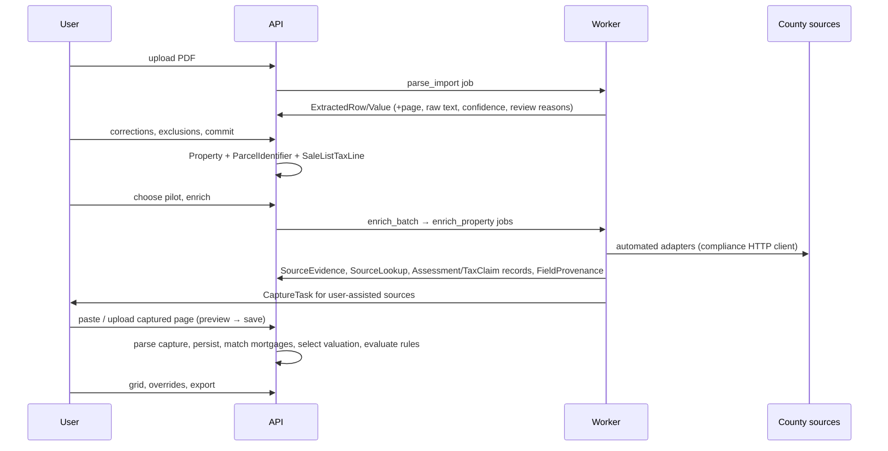

# Architecture

## Runtime components

| Component | Technology | Responsibility |
|---|---|---|
| Web UI | React 19, TypeScript, AG Grid Community, Vite | Projects, import review, pilot selection, user-assisted capture queue, results grid, property drawer, settings, audit |
| API | FastAPI (OpenAPI at `/docs`) | Every operation; role-aware auth (local, or bearer tokens with viewer/analyst/admin) |
| Worker | `python -m app.jobs.worker` | Claims jobs from the DB queue: parse, enrich batch/property, valuations, tax refresh, rule recompute, export. Hosts the APScheduler daily cron. |
| Database | SQLite (local) / PostgreSQL (compose) via SQLAlchemy 2 + Alembic | Normalized domain model, jobs, audit |
| Data directory | filesystem | Uploaded sale lists, content-addressed evidence snapshots, exports, uploaded images, dev master key |

## Data flow

## Domain model (normalized)

- **Project** — county, name, demo flag.
- **ImportedSaleList → ExtractedRow → ExtractedValue** — per-field raw value, normalized value, confidence, and correction history.
- **Property** — sale-list facts (sale/record number, parcel original, normalized and search key, owner, mailing address, location, municipality, amounts, description, lot), PDF page, extraction confidence, pilot flag, decision.
- **ParcelIdentifier** — search keys per system: GIS key, civil key, datalet PIN, county detail link, map ID.
- **SaleListTaxLine** — the Delco per-year CTY/SCH/TWN lines.
- **SourceEvidence** — immutable snapshot: SHA-256, path, URL, redacted request summary, HTTP status, entry method, parser version.
- **SourceLookup** — per property and source status history (`is_current`).
- **FieldProvenance** — per-field value, raw value, source, URL, evidence, quality, confidence and notes.
- **AssessmentRecord / AssessmentSale** — one row per source; superseded rows are kept.
- **TaxClaimRecord / TaxClaimYear / TaxStatusHistory** — claim, receivable and delinquent years; per-refresh history with a change flag.
- **RecorderDocument / MortgageRecord / SatisfactionMatch** — classified documents, transparent match candidates, reviewer decisions.
- **CivilLienCase** — relevant cases only, with the reason each was retained.
- **ValuationRecord / ValuationSelection / PropertyImage / ProviderConfig / EncryptedSecret**.
- **RuleSet / RuleEvaluation** — versioned configuration and per-rule outcomes.
- **Job / RefreshRun / AuditLog / SavedView / ExportRecord / WorkbookTemplate / SourcePolicy / CaptureTask / UserOverride / User**.

JSON columns hold only configuration, job payloads, diagnostics and raw code maps, never the primary property facts.

## Snapshot read model

`app/services/snapshot.py` bulk-loads all current records for a set of properties and resolves every grid, export and rule field to a `Cell`: value, source, URL, retrieval time, quality, raw value, notes, evidence ID and confidence. Source precedence:

- **Montgomery:** user override → portal capture → official GIS → sale list.
- **Delaware:** user override → portal capture → GIS → sale list.

Delaware GIS acreage is *estimated*. Demo fixtures are *estimated* and labelled **DEMO FIXTURE**. Tax values older than the refresh window are *stale*. Because the grid, the export and the rules all use the same model, they never disagree.

## Rules engine

`app/rules/engine.py` evaluates pure functions over a `RuleInputs` snapshot:

| Rule | What it checks |
|---|---|
| Tax sale status | Montco 2024 balance of $0.00 means resolved (row red, overridable). Delco "Listed for Upset Sale" is green; anything else is red, or removed. |
| Market valuation | Below the threshold means not interested (orange). |
| Property type & size | Single-family, twin and row ≥ 900 sq ft; condo ≥ 600; land ≥ 1 acre, with estimated acreage near the line going to review; commercial/multi-family per policy. |
| Mortgages since 1990 | Policy for unsatisfied and uncertain mortgages. |
| Civil liens | Policy for relevant open liens. |
| Extraction data quality | Flagged or low-confidence sale-list rows. |
| Assessment < $100k | Informational, highlighted orange. |

The decision is Removed/resolved → Not interested → Insufficient data (an essential rule is unknown) → Review required → Interested. A manual override records the computed decision in the explanation.

## Mortgage matching

`app/recorder/matching.py` handles recorder documents in four steps:

1. **Classify** each document: deed, mortgage, satisfaction, assignment, release, modification, subordination.
2. **Match** satisfactions to mortgages:
   - A satisfaction citing the mortgage's instrument or book/page auto-confirms it. Releases still need review.
   - Otherwise it is scored on lender/assignee similarity, borrower similarity (typo-tolerant) and amount.
   - Only a strong, unique match auto-confirms.
   - Borrower-only matches go to review.
   - A satisfaction citing a different instrument is excluded.
3. **Assign statuses:** Satisfied, No satisfaction found, Potential match — review required, Insufficient data.
4. **Reviewer decisions** confirm or reject candidates, and recomputes preserve those decisions.

## Jobs

The DB-backed queue works on SQLite and PostgreSQL:

- **Enqueue:** idempotency keys, so a duplicate request returns the job already queued or running.
- **Claim:** an atomic conditional UPDATE.
- **Liveness:** heartbeats, plus stale-job recovery after 15 minutes.
- **Retries:** exponential backoff with jitter.
- **Batches:** parent/child jobs with progress tracking, and cancel/retry.
- **Resumable enrichment:** successful sources are cached by TTL, so a retry only repeats failed sources.

## Export

`app/export/xlsx_exporter.py` builds the **Updated Sale List** sheet from `app/export/workbook_spec.py`:

- **Layout:** Montgomery reproduces the reference headers A–AJ. Widths and header styles come from the built-in template, which was derived from the reference workbook with no cell data. Delaware County uses the equivalent layout. Application additions follow, with dark grey headers.
- **Conditional formatting:** written as formulas, so colours stay correct when values are edited in Excel.
- **Sheet setup:** numeric cells, date formats, freeze panes at D2, autofilter, hyperlinks.

Supporting sheets:

- Mortgage Info
- Lien Cases
- Sources (per-field provenance)
- Source Catalog
- Refresh Log
- Tax Status History
- Errors & Review Queue
- User Action Tasks
- PDF Extraction
- Configuration
- Audit Log
- Notes & Legend

## Adding a county

1. Implement a parser in `app/ingestion/parsers/` and register it in `parsers/__init__.py`.
2. Add a parcel pattern to `app/common/parcels.py`.
3. Create `app/connectors/<county>/` with a `CountyConnector` subclass and `SourceAdapter`s, each with a complete `SourceDescriptor`.
4. Register the connector in `app/connectors/registry.py` and give it a column layout in `app/export/workbook_spec.py`.
5. Add classification rules in `app/rules/classification.py` if the county's property-type vocabulary differs.
